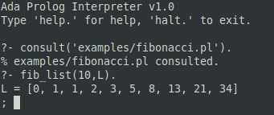

# Prolog Interpreter in Ada

A fully-featured Prolog interpreter written in Ada, implementing core logic programming features including unification, backtracking, and a set of built-in predicates.



## Features

- **Core Prolog**
  - Facts and rules
  - Unification with occurs check
  - Backtracking via choice points
  - Cut operator (!)
  - Negation as failure (\+)

- **Data Types**
  - Atoms
  - Variables (including anonymous `_`)
  - Integers
  - Floating-point numbers
  - Compound terms
  - Lists with `[H|T]` notation

- **Arithmetic**
  - Basic operators: `+`, `-`, `*`, `/`, `mod`, `**`
  - Comparison: `<`, `>`, `=<`, `>=`, `=:=`, `=\=`
  - Functions: `abs`, `sqrt`, `floor`, `ceiling`, `round`, `truncate`
  - Mixed integer/float arithmetic

- **Built-in Predicates**
  - 40+ predicates for control, I/O, type checking, term manipulation, and database operations

- **Additional Features**
  - DCG (Definite Clause Grammar) support
  - Interactive REPL with multi-line input
  - File consulting via `consult/1`

## Requirements

- GNAT Ada compiler (GCC Ada)
- GNU Make

## Building

```bash
# Build the interpreter
make all

# Build with debug symbols
make debug

# Build optimized release
make release

# Clean build artifacts
make clean
```

## Usage

### Interactive Mode

```bash
./bin/prolog
```

```prolog
?- member(X, [1, 2, 3]).
X = 1
; X = 2
; X = 3
; false.
```

### Load a File

```bash
./bin/prolog examples/factorial.pl
```

Or from within the REPL:

```prolog
?- consult('examples/factorial.pl').
```

### Run Tests

```bash
make test
```

## Quick Examples

```prolog
% Facts
parent(tom, mary).
parent(mary, ann).

% Rules
grandparent(X, Z) :- parent(X, Y), parent(Y, Z).

% Queries
?- grandparent(tom, ann).
true.

% Arithmetic
?- X is 3.14 * 2.
X = 6.28

% Lists
?- append([1,2], [3,4], X).
X = [1, 2, 3, 4]
```

## Documentation

- [Built-in Predicates](docs/builtins.md) - Complete reference of all built-in predicates
- [Examples](docs/examples.md) - Guide to the example programs
- [Tests](docs/tests.md) - Test suite documentation

